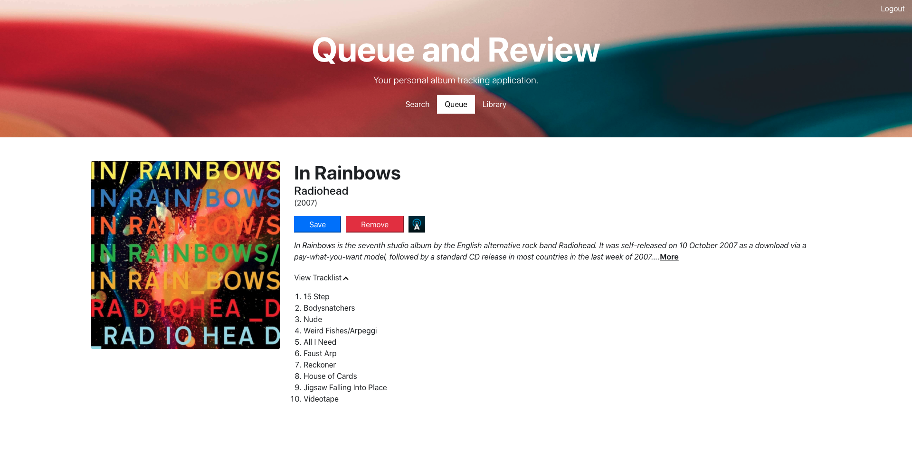

# Queue and Review

Queue and Review is an album tracking application that allows the user to keep track of albums they want to listen to and store them in their personal library upon listening. The user can enter an artist name to view a list of albums released by that artist, including album art, title, release year, tracklists and any available descriptions and/or AllMusic paages for each album. The user can add an album to their own queue of albums to listen to.  Upon listening, the user can add the album to their library along with custom feedback, including the date listened, user review, user rating out of 5 stars, and up to 3 select tracks.



**Deployed Application:** (https://queueandreview.herokuapp.com/)

## Getting Started

These instructions will get you a copy of the project up and running on your local machine for development and testing purposes.

### Prerequisites

Please ensure all of the following prerequisites are installed on your local development machine:

* Git - [Download & Install Git](https://git-scm.com/downloads). OSX and Linux machines typically have this already installed.

* Node.js - [Download & Install Node.js](https://nodejs.org/en/download/) and the npm package manager. If you encounter any problems, you can also use this [GitHub Gist](https://gist.github.com/isaacs/579814) to install Node.js.

* MongoDB - [Download & Install MongoDB](https://www.mongodb.com/try/download/community), and make sure it's running on the default port (27017).

### Download

There are two ways you can get the code:

### Cloning The GitHub Repository
The recommended way to get Queue and Review is to use git to directly clone the [QueueAndReview] repository:

```bash
$ git clone https://github.com/rademakerjohn1/QueueAndReview.git Queue-and-Review
```

This will clone the latest version of the Queue and Review repository to a **Queue-and-Review** folder.

### Downloading The Repository Zip File
Another way to use the Queue and Review code is to download a zip copy from the [master branch on GitHub](https://github.com/rademakerjohn1/queueandreview/archive/master.zip). You can also do this using the `wget` command:

```bash
$ wget https://github.com/rademakerjohn1/queueandreview/archive/master.zip -O queue-and-review.zip; unzip queue-and-review.zip; rm queue-and-review.zip
```

Don't forget to rename after your project name.

### Install

Once you've downloaded and installed prerequisites, you're ready to begin install process. 

The project comes pre-bundled with a `package.json`file that contains the list of modules you'll need to run the application.

To install dependencies, run this in the application folder from the command-line:

```bash
$ npm install
```
This command does a few things:
* First it will install the dependencies needed for the application to run.
* If you're running in a development environment, it will then also install development dependencies needed for testing and running your application.
* It will navigate into the client folder and install dependencies needed to support React components
* To update these packages later on, just run `npm update`

## Running The Application

Run the application using npm:

```bash
$ npm run start
```

Your application should run client-side on port 3000 with the *development* environment configuration, so in your browser just go to [http://localhost:3000](http://localhost:3000)

The server should boot up concurrently on port 8080. Once client has compiled successfully, your browser should automatically open to port 3000 and your app should be running. 

## Running the tests

```bash
$ npm test
```

## Built With

* [React](https://reactjs.org/) - Client-side javascript library for building user interfaces
* [NodeJs](https://nodejs.org/en/docs/) - The Server-Side library Used
* [Express](https://expressjs.com/) - Server technology
* [Passport](http://www.passportjs.org/) - Secure user authentication
* [Mongoose](https://mongoosejs.com/) - MongoDB ORM

## Built By

* **John Rademaker**

## License

This project is licensed under the MIT License - see the [LICENSE.md](LICENSE.md) file for details